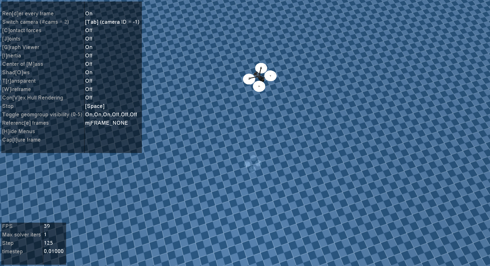

# drone_control
This is a machine learning based drone controlling project for NUS MSc in Robotics module ME5418: Machine Learning in Robotics.

## Setup
### 1. Clone the repo
```
git clone https://github.com/PiusLim373/drone_control.git
```
### 2. Setup using Conda
```
cd drone_control
conda env create -f requirement.yml
conda activate me5418-drone-control
```
This will create a conda environment me5418-drone-control with necessary packages installed to run the project.

## Running the Gym Environment Demo (Assignment 1)
Assignment 1 is about showing a working version of the gym environment that will allow subsequent program to call and step through the environment with specific action and get some state data in return.
``` 
python gym_demo.py
```
This demo script will create an environment in demo mode and run for 140steps for visualization. There are 5 checkpoints in this demo.

:warning: You will need to press ECS key to end the rendering at the end of each checkpoint so that the demo will continue.

#### Checkpoint 1
First 25steps, spawn the quadcopter and wait for it to reach a stable stationary state.


#### Checkpoint 2
For the next 50steps, activate all 4 rotors and the quadcopter will take off.


#### Checkpoint 3
For the next 50steps, activate the diagonal rotor 1 and rotor 3 and the quadcopter will rotate perform yaw rotation.


#### Checkpoint 4
For the next 15steps, activate the back rotor 3 and rotor 4 and the quadcopter will rotate perform pitch rotation.


#### Checkpoint 5
Reset the environment, spawn the quadcopter and wait for it to reach a stable stationary state.

### 3. Unit Tests
```
python gym_unittests.py
```


## Running the Neural Network Demo (Assignment 2) 
Assignment 2 is about showing a working version of the neural network that will allow subsequent program to send in some states and get the Actor and Critic network to perform some prediction.

Proximal Policy Optimization (PPO) is chosen as this assignment's algorithm. Therefore, some related functions like advantages, weighted probability, policy and value losses neural_network_demo.py are included as well.  
``` 
python neural_network_demo.py
```
This demo will run for 5 episodes, and for every 20 steps of data collected, the network update will:
1. Randomly shuffle the data and group into mini-batch of 5.
2. Calculate advantages.
3. Calculate policy loss and value loss.
4. Calculate total loss.
5. Backward propagation and update the network.
6. Repeat Step 2 to Step 5 five times for each mini-batch.
7. Clear the memory and ready for the next 20 steps of data.

### Actor and Critic Network Weight (truncated) At Start


### Actor and Critic Network Weight (truncated) At End of 5 Episodes


## Running the Learning Agent Demo (Assignment 3) 
Stay tuned, coming soon!