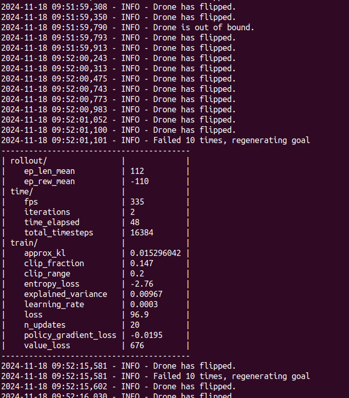
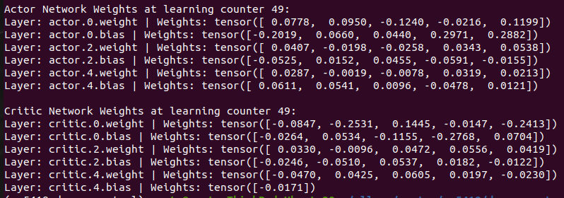
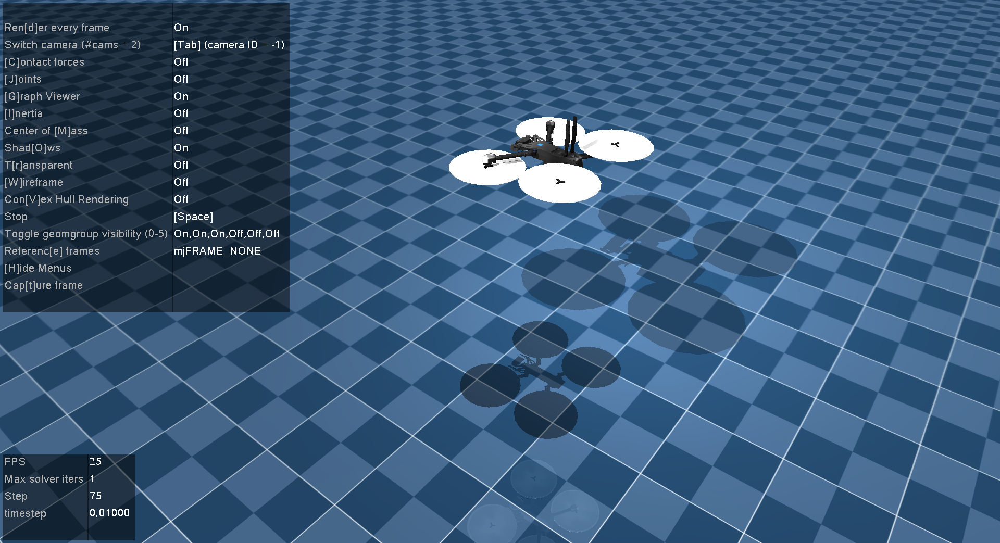

# drone_control
This is a machine learning based drone controlling project for NUS MSc in Robotics module ME5418: Machine Learning in Robotics.

## Setup
### 1. Clone the repo
```
git clone https://github.com/PiusLim373/drone_control.git
```
### 2. Setup using Conda
```
cd drone_control
conda env create -f requirement.yml
conda activate me5418-drone-control
```
This will create a conda environment me5418-drone-control with necessary packages installed to run the project.

## Final Submission
### Training
There are two version of training agents method provided:

#### 1. Custom Training Agent Implemented by The Project Group
```
# To run training
python training_agent_demo.py

# To show tensorboard, run the following command and go to http://localhost:6006/#scalars
tensorboard --logdir saves/ 
```


#### 2. Stable Baselines3 (Recommended)
```
# To run training
python training_agent_demo_stable_baselines3.py

# To show tensorboard, run the following command and go to http://localhost:6006/#scalars
tensorboard --logdir saves/ 
```



:warning: The training will run for 16mil steps and autosave every 10k steps in the `saves/` folder by default, change the `N_STEPS` and `AUTO_SAVE_STEP` based on your needs.

### Testing
After the training is done, saved model in the `saves/` folder can be loaded and test. Similar to training, there are two versions of test and two sample models provided for each agent.

#### 1. Custom Training Agent Implemented by The Project Group
```
python test_agent.py
```

#### 2. Stable Baselines3 (Recommended)
```
python test_agent_stable_baselines3.py
```

:warning: The test program will use the sample model provided by default, change the `MODEL` to use another model. 

:warning: When the test program is run, the drone will be spawn in a continuous environment where goal will get updated whenever reached and environment will only be reset when drone is flipped, dropped to ground or out of bound. This test environment will show the full capability of the trained agent.

### Video
[](https://www.youtube.com/watch?v=by-sKn-rrAY&feature=youtu.be)

## Past Assigment
### Running the Learning Agent Demo (Assignment 3) 
Assignment 3 is about showing a training agent that connects all previous assignments together.

The agent is a big class that holds the two neural network created and the memory. And by running a specified amount of episodes and collecting data, the agent will send these step data to the neural networks for training.  
``` 
# To run training
python training_agent_demo.py

# To show tensorboard, run the following command and go to http://localhost:6006/#scalars
tensorboard --logdir saves/ 
```
This demo script will run for 20 episodes, similar to the above neural network demo, for every 1024 step data collected, a mini batch size of 64 data will be sent to the network and run for 10epochs. On every best average score obtained and at the end of training, the weight file will be saved in the `saves/` folder.

:warning: The script will be rendering visualization by default, this can be disable by setting the `RENDER` flag false in the demo script, speeding up the training speed.


To test out the trained model, the following command can be used. 
```
python test_agent.py
```
The testing script will use the model supplied and run for 5 episodes and log the rewards obtained for each episode.


:warning: A sample trained model is included along with the submission. Feel free to change `ACTOR_MODEL` and `CRITIC_MODEL` to another weight file in the `saves/` folder.

### Running the Neural Network Demo (Assignment 2) 
Assignment 2 is about showing a working version of the neural network that will allow subsequent program to send in some states and get the Actor and Critic network to perform some prediction.

Proximal Policy Optimization (PPO) is chosen as this assignment's algorithm. Therefore, some related functions like advantages, weighted probability, policy and value losses neural_network_demo.py are included as well.  
``` 
python neural_network_demo.py
```
This demo will run for 5 episodes, and for every 20 steps of data collected, the network update will:
1. Randomly shuffle the data and group into mini-batch of 5.
2. Calculate advantages.
3. Calculate policy loss and value loss.
4. Calculate total loss.
5. Backward propagation and update the network.
6. Repeat Step 2 to Step 5 five times for each mini-batch.
7. Clear the memory and ready for the next 20 steps of data.

#### Actor and Critic Network Weight (truncated) At Start


#### Actor and Critic Network Weight (truncated) At End of 5 Episodes


### Running the Gym Environment Demo (Assignment 1)
Assignment 1 is about showing a working version of the gym environment that will allow subsequent program to call and step through the environment with specific action and get some state data in return.
``` 
python gym_demo.py
```
This demo script will create an environment in demo mode and run for 140steps for visualization. There are 5 checkpoints in this demo.

:warning: You will need to press ECS key to end the rendering at the end of each checkpoint so that the demo will continue.

##### Checkpoint 1
First 25steps, spawn the quadcopter and wait for it to reach a stable stationary state.


##### Checkpoint 2
For the next 50steps, activate all 4 rotors and the quadcopter will take off.


##### Checkpoint 3
For the next 50steps, activate the diagonal rotor 1 and rotor 3 and the quadcopter will rotate perform yaw rotation.


##### Checkpoint 4
For the next 15steps, activate the back rotor 3 and rotor 4 and the quadcopter will rotate perform pitch rotation.


##### Checkpoint 5
Reset the environment, spawn the quadcopter and wait for it to reach a stable stationary state.

#### 3. Unit Tests
```
python gym_unittests.py
```